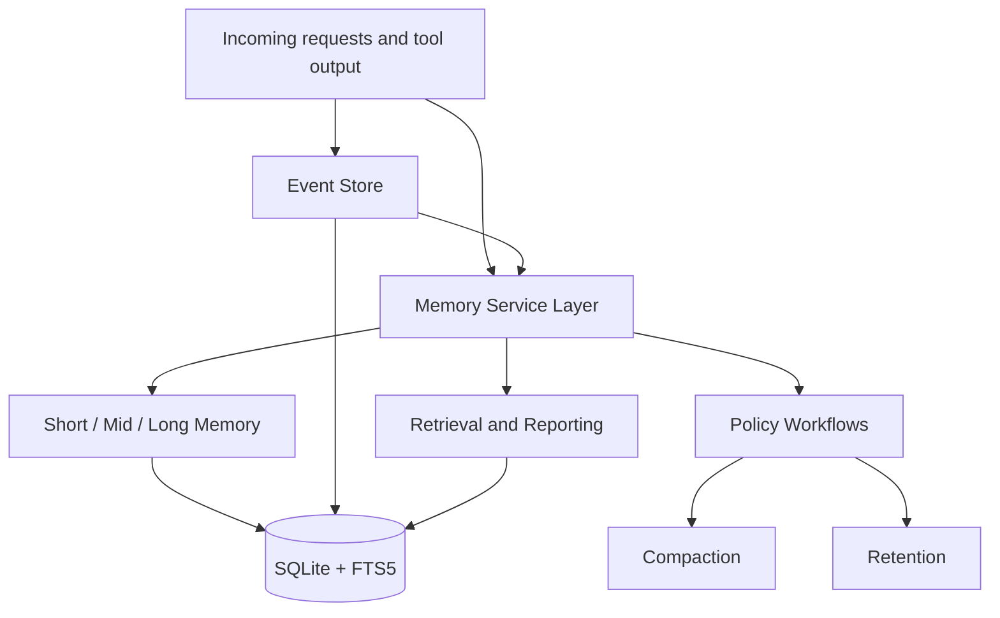

# GlialNode

<p align="center">
  
</p>


GlialNode is a memory system for orchestrators, agents, and subagents.

It is designed for systems that need more than a chat transcript. GlialNode gives you structured memory, scoped recall, lifecycle policy, and operational tooling in one SQLite-first package.

It is built around three ideas:

- tiered memory: short, mid, and long-term state
- scoped memory: separate spaces for different orchestrators, projects, and agents
- retrieval over replay: search and inject only the memory that matters now

## Why GlialNode

Most agent memory attempts fall into one of two traps:

- they replay too much raw history into context
- they store data, but do not manage it as memory

GlialNode takes a different path:

- it separates operational events from curated memory records
- it treats memory as scoped, tiered, and policy-driven
- it supports provenance, lifecycle operations, and observability
- it stays local and inspectable with a SQLite-first architecture

The goal is not just to save facts. The goal is to manage memory as a living system.

For automation and integrations, GlialNode also supports stable `--json` output on key read/report flows such as `space show`, `space report`, `space graph-export`, `space inspect-export`, `memory search`, `memory recall`, `memory trace`, `memory bundle`, `preset bundle-show`, and `preset bundle-import`.
If you want a versioned machine contract wrapper, add `--json-envelope` together with `--json` to receive `{ schemaVersion, command, generatedAt, data }`.
`space show` and `space report` now include a `policy` block with `raw`, `effective`, and `origin` fields so you can inspect what was set directly vs what came from defaults.

For operator diagnostics, GlialNode also includes `glialnode doctor`, which inspects the live SQLite runtime, schema version, database path, preset registry, signing-key store, and trusted-signer store in one health report. Use `glialnode doctor --json` when you want a machine-readable readiness check.

## Why It Saves Tokens

GlialNode is built to reduce context waste.

Instead of replaying whole transcripts or injecting large raw logs back into a model, it keeps operational history separate from curated memory, retrieves only relevant records, and supports compact internal memory text for lower-token recall and handoff flows.

That makes it a better fit for long-running agent systems where context quality and token cost matter at the same time.

## Vision

GlialNode aims to provide a publishable, open-source memory layer for orchestrators, agents, and multi-agent systems.

The v1 architecture is SQLite-first and built around:

- an event log for operational history
- structured memory records with tiers and scopes
- FTS-backed retrieval for continuity and recall
- promotion and decay rules that keep active memory small

## Architecture At A Glance



## Current Capabilities

- create isolated memory spaces
- scope memory to agents, subagents, sessions, tasks, and projects
- store curated records, raw events, and provenance links
- store both human-readable memory text and compact internal memory text
- search memory with query-aware lexical retrieval and structured filters
- optionally apply an explicit semantic-prototype reranker on top of lexical search for eval-only experiments
- promote, archive, compact, and expire records through explicit policy workflows
- distill related active records into durable summary memory with provenance links
- detect contradictory durable memory and preserve it as contested state
- attach bundle annotations and consumer hints for actionable, stale, distilled, contested, or provenance-aware handoff memory
- tune auto-routing behavior per space so different memory spaces can lean toward review, planning, or execution
- start spaces from named brain-style presets instead of configuring every policy family manually
- configure compaction and retention policy per space
- apply hardened SQLite defaults for file-backed databases
- track applied SQLite schema versions inside the database
- inspect memory health through reporting and maintenance commands
- export space topology as graph JSON for link/provenance visualization or external graph tooling
- import and export versioned full-space snapshots with checksum validation
- optionally sign full-space snapshots and enforce trust policies during restore

## How It Fits

GlialNode is a good fit when you want:

- a local-first memory layer
- strong inspectability over opaque hosted storage
- structured recall for multi-agent workflows
- lifecycle operations such as compaction, retention, and maintenance
- a codebase you can extend without needing a separate database service first

It is less ideal if you already need:

- high-concurrency multi-writer coordination
- large-scale semantic/vector retrieval as the primary retrieval mode
- a distributed storage system from day one

## Initial Roadmap

1. Define the v1 domain model for spaces, scopes, events, records, and links.
2. Add the SQLite bootstrap schema and retrieval indexes.
3. Implement a basic repository and memory service layer.
4. Add a small CLI for inspecting spaces, records, and schema state.
5. Publish examples for orchestrator and subagent integration.

## Repo Layout

- `src/core`: shared types and constants
- `src/events`: operational events
- `src/memory`: tier and retrieval logic
- `src/storage`: storage adapters and schema support
- `src/cli`: command-line entrypoints
- `docs`: architecture notes

## Status

GlialNode currently includes:

- the v1 domain model for spaces, scopes, events, records, and links
- a SQLite bootstrap schema with FTS5 indexing and sync triggers
- a working SQLite repository implementation
- a typed `GlialNodeClient` for programmatic use
- space-aware bundle validation/import helpers in `GlialNodeClient`
- compact memory encoding for lower-token internal recall
- query-aware retrieval ranking and record promotion helpers
- a functional CLI for spaces, scopes, and memory records
- import/export and memory lifecycle commands
- record provenance and link management
- compaction history with system events and summary records
- semantic distillation of related records during compaction
- automatic contradiction detection with confidence penalties on older conflicting memory
- time-based confidence and freshness decay for stale durable memory
- explicit reinforcement workflows that strengthen confirmed memory again
- per-space policy settings for configurable memory behavior
- SQLite connection hardening with WAL, busy timeout, foreign keys, and runtime inspection
- applied SQLite migration tracking and schema-version introspection
- active retention sweeps with expiration events and summaries
- space-level reporting for memory and lifecycle observability
- unified maintenance workflow for operational upkeep
- provenance audit events for space-scoped preset bundle review/import
- repository tests for core persistence and lexical search

## Current Notes

GlialNode currently uses Node's built-in `node:sqlite` module to keep the first release lightweight. In Node 24, that API is still marked experimental, so a later release may choose to wrap it behind a stricter storage boundary or swap the underlying SQLite driver without changing the GlialNode memory model.

File-backed SQLite connections now default to:

- `journal_mode=WAL`
- `synchronous=NORMAL`
- `busy_timeout=5000`
- foreign key enforcement enabled
- defensive mode enabled when the runtime supports it

GlialNode now treats that explicitly as a write-mode contract:

- default `writeMode=single_writer`
- optional `writeMode=serialized_local` for host applications that already serialize writes through one local queue or coordination boundary

You can request serialized local write queuing via:

- client: `new GlialNodeClient({ filename: "...", writeMode: "serialized_local" })`
- CLI: `glialnode status --write-mode serialized_local`

What GlialNode does guarantee:

- the default runtime is tuned for local durability and reduced immediate lock failures
- the status surface reports the active write-mode contract and its guarantees
- `serialized_local` mode applies a lightweight in-process write queue adapter so concurrent mutation calls are serialized locally

What GlialNode does not guarantee:

- no built-in cross-process write broker
- no distributed or high-concurrency multi-writer contract

These defaults make the local single-writer story sturdier, but they do not turn SQLite into a high-concurrency distributed store.

Storage adapters also expose a small backend contract through `describeStorageAdapter(...)`, including capability flags for local-first operation, full-text search, schema migrations, and cross-process write coordination. See `docs/storage-backends.md` for the current SQLite contract and future server-backed adapter boundary.
Host apps can inspect the same path with `client.getStorageContract()` and `client.planStorageMigration({ target: "postgres" })`.

## Portable Snapshots

GlialNode full-space snapshots are now versioned portable artifacts, not just raw JSON dumps.

Each snapshot can carry:

- `snapshotFormatVersion`
- `glialnodeVersion`
- `nodeEngine`
- `checksum`
- optional signer and Ed25519 signature metadata

That means export/import can now:

- detect corruption before restore
- reject unsupported snapshot formats
- warn on runtime mismatches
- optionally require signed or anchored imports for stricter operational workflows
- require explicit collision policy when restoring into an already-imported target

Current import collision behavior:

- default `collision=error`
- explicit `collision=overwrite` to reuse existing target ids
- explicit `collision=rename` to import a second copy under new ids
- optional `--preview` mode to inspect counts, conflicts, schema status, trust validation, and remap outcomes before apply

GlialNode also records applied SQLite migrations inside the database so bootstrap stays idempotent and the runtime can report the actual schema version that has been applied.

Memory records now support a compact internal form as well. GlialNode keeps the readable `content` and `summary`, but it can also store a denser symbolic representation in `compactContent` for memory compression and retrieval.

## Quick Start

```bash
npm install
npm run check
npm test
npm run demo
npm run demo:client
npm run demo:dashboard
npm run pack:check
glialnode doctor --json
glialnode status --json --json-envelope
```

You can also start a space from a preset brain style:

- `balanced-default`
- `execution-first`
- `conservative-review`
- `planning-heavy`

And you can inspect them directly before applying one:

- `glialnode preset list`
- `glialnode preset show --name planning-heavy`
- `glialnode preset diff --left builtin:execution-first --right builtin:conservative-review`

Built-in presets can also be exported to JSON and reused as custom preset files:

- `glialnode preset export --name execution-first --output ./execution-first.json`
- `glialnode preset show --input ./execution-first.json`

If you want to keep a reusable local registry of custom brain styles, you can also register them once and reuse them by name:

- `glialnode preset register --input ./execution-first.json --name team-executor --author "Memory Team" --version 2.1.0`
- `glialnode preset local-list`
- `glialnode preset local-show --name team-executor`
- `glialnode preset keygen --name team-executor-key --signer "GlialNode Test"`
- `glialnode preset key-list`
- `glialnode preset key-show --name team-executor-key`
- `glialnode preset key-export --name team-executor-key --output ./team-executor.public.pem`
- `glialnode preset trust-local-key --name team-executor-key --trust-name team-anchor`
- `glialnode preset trust-register --input ./team-executor.public.pem --name team-public --signer "GlialNode Test"`
- `glialnode preset trust-list`
- `glialnode preset trust-show --name team-anchor`
- `glialnode preset trust-pack-register --name strict-signed --base-profile signed --allow-origin production`
- `glialnode preset trust-pack-list --json`
- `glialnode preset trust-pack-show --name strict-signed --json`
- `glialnode preset trust-revoke --name team-anchor`
- `glialnode preset trust-rotate --name team-anchor --input ./team-executor-v2.public.pem --next-name team-anchor-v2`
- `glialnode preset trust-profile-list`
- `glialnode preset history --name team-executor`
- `glialnode preset rollback --name team-executor --to-version 2.1.0`
- `glialnode preset promote --name team-executor --channel stable --version 2.1.0`
- `glialnode preset channel-list --name team-executor`
- `glialnode preset channel-show --name team-executor --channel stable`
- `glialnode preset channel-default --name team-executor --channel stable`
- `glialnode preset channel-export --name team-executor --output ./team-executor.channels.json`
- `glialnode preset channel-import --input ./team-executor.channels.json --name team-executor-copy`
- `glialnode preset bundle-export --name team-executor --output ./team-executor.bundle.json`
- `glialnode preset bundle-show --input ./team-executor.bundle.json`
- `glialnode preset bundle-show --input ./team-executor.bundle.json --trust-profile signed`
- `glialnode preset bundle-show --input ./team-executor.bundle.json --require-signature --allow-key-id <fingerprint>`
- `glialnode preset bundle-show --input ./team-executor.bundle.json --require-signature --trust-signer team-anchor`
- `glialnode preset bundle-show --input ./team-executor.bundle.json --trust-profile anchored --trust-signer team-anchor`
- `glialnode preset bundle-show --input ./team-executor.bundle.json --allow-origin production --trust-explain --json`
- `glialnode preset bundle-show --input ./team-executor.bundle.json --trust-pack strict-signed`
- `glialnode preset bundle-show --input ./team-executor.bundle.json --space-id <space-id>`
- `glialnode preset bundle-import --input ./team-executor.bundle.json --name team-executor-copy`

`bundle-show` now reports the selected trust profile, effective policy, signer key id, matched trusted signers, requested trusted signers, and unmatched trusted signers so provenance decisions are inspectable instead of opaque. Add `--trust-explain` (and optionally `--json`) to inspect policy failures without throwing. When a bundle is reviewed or imported with `--space-id`, GlialNode also records `bundle_reviewed` and `bundle_imported` events for that space so trust decisions become part of the audit trail and show up in `space report`. Those same workflows now also write searchable audit summary records, so bundle trust decisions can be recalled later through normal memory search instead of living only in event output.
- `glialnode space create --name "Stable Memory" --preset-local team-executor --preset-channel stable`
- `glialnode space configure --id <space-id> --preset-local team-executor --preset-channel candidate`

Preset files and registered local presets can also carry provenance metadata like `version`, `author`, `source`, `createdAt`, and `updatedAt`, and the local registry now keeps versioned snapshot history for each registered preset. That gives a shared brain style some lineage instead of treating every update like an overwrite with no memory of what came before.

You can also diff preset definitions directly to see how one brain style differs from another at the metadata and settings level. The CLI accepts `builtin:`, `local:`, and `file:` references so you can compare built-ins, registered local presets, and exported preset files with one command. And if a local preset needs to move back to an earlier known-good version, rollback can restore a historical snapshot while still preserving the new restore operation in history. Release channels then let a team point consumers at `stable`, `candidate`, or any other named lane without forcing every integration to pin a raw version string, a default channel can be set so local preset consumers do not have to spell the lane out on every space command, channel manifests can be exported or imported so those release lanes can travel between machines and repos, and full preset bundles can now move the active preset, its history, and its channel manifest together as one portable brain-style package. Those bundles now carry explicit format/runtime metadata, and GlialNode validates that metadata on inspection/import so unsupported bundle formats are rejected early instead of being applied blindly.

The demo paths are Node-based and intended to run on Windows, Linux, and macOS:

- `npm run demo` exercises the CLI workflow
- `npm run demo:client` exercises the typed client API directly
- `npm run example:service` exercises a realistic embedded service loop using `GlialNodeClient`
- `npm run example:agent-loop` exercises a trust+recall+maintenance loop with signed snapshot preview/import

## Example Report

This is the kind of operational summary GlialNode can emit after maintenance:

```text
spaceId=space_example
records=4
events=2
links=2
tiers=mid:3,short:1
statuses=active:3,expired:1
kinds=summary:2,task:2
eventTypes=memory_expired:1,memory_promoted:1,memory_written:2
provenanceSummaryRecords=0
maintenanceLatestRunAt=2026-04-17T12:00:03.000Z
maintenanceLatestCompactionAt=2026-04-17T12:00:02.000Z
maintenanceLatestRetentionAt=2026-04-17T12:00:03.000Z
maintenanceLatestDecayAt=
maintenanceLatestReinforcementAt=
maintenanceCompactionDelta={"promoted":1,"archived":0,"refreshed":0,"distilled":0,"superseded":0}
maintenanceRetentionDelta={"expired":1}
maintenanceDecayDelta={}
maintenanceReinforcementDelta={}
recentLifecycleEvents=2
evt_x memory_expired Retention expired mem_y after 0 day(s).
evt_z memory_promoted Compaction promoted mem_a from short to mid.
```

## What The Demo Shows

The demo flow exercises the main operational loop:

1. create a space
2. configure policy
3. add working records
4. run maintenance
5. inspect the resulting report
6. export the final snapshot

That makes it a good first check for whether the current project shape matches your use case.

The client demo follows the same lifecycle through `GlialNodeClient`, which makes it a better fit if you plan to embed GlialNode into another Node application.

## Benchmark Harness

GlialNode includes a local benchmark harness for search, recall, bundle build, compaction dry-run, and report generation across 1k/10k/50k seeded records:

```bash
npm run bench
npm run bench:provenance
npm run eval:semantic
```

Latest baseline details are documented in `docs/benchmarks.md` and raw machine output is written to:
- `docs/benchmarks/latest.json`
- `docs/benchmarks/provenance-latest.json`

## Example Service

For a more production-like embedding flow, run:

```bash
npm run example:service
npm run example:agent-loop
```

The example service ingests session events/records, builds pre-reply context, runs maintenance, emits report telemetry, and exports a portable snapshot. The agent-loop example adds trust-anchor setup, signed snapshot export, import preview, and anchored restore. See `examples/memory-service/README.md` and `examples/agent-loop/README.md` for details.

## Library Example

GlialNode can be used directly from code without shelling out to the CLI:

```ts
import { GlialNodeClient } from "glialnode";

const client = new GlialNodeClient({
  filename: ".glialnode/app.sqlite",
});

console.log(client.listPresets());
client.exportPreset("execution-first", "./execution-first.json");
client.registerPreset("./execution-first.json", {
  name: "team-executor",
  author: "Memory Team",
  version: "2.1.0",
});

const space = await client.createSpace({
  name: "Team Memory",
  preset: "planning-heavy",
  settings: {
    provenance: {
      trustProfile: "anchored",
      trustedSignerNames: ["team-anchor"],
    },
  },
});
const scope = await client.addScope({
  spaceId: space.id,
  type: "agent",
  label: "planner",
});

await client.addRecord({
  spaceId: space.id,
  scope: { id: scope.id, type: scope.type },
  tier: "mid",
  kind: "decision",
  content: "Prefer lexical retrieval first.",
  summary: "Retrieval preference",
});

const matches = await client.searchRecords({
  spaceId: space.id,
  text: "lexical retrieval",
  limit: 5,
});

const bundleReview = await client.validatePresetBundleForSpace("./team-executor.bundle.json", {
  spaceId: space.id,
});

console.log(matches.map((record) => record.summary ?? record.content));
console.log(bundleReview.report.trustProfile);
client.close();
```

The client also accepts SQLite connection policy overrides when you need to tune lock handling or journaling for a local deployment.

Search stays side-effect free by default, but host apps can opt into reinforcing records that proved useful:

```ts
const matches = await client.searchRecords(
  {
    spaceId: space.id,
    text: "lexical retrieval",
    limit: 5,
  },
  {
    reinforce: {
      enabled: true,
      limit: 2,
      strength: 1.5,
      reason: "successful-retrieval",
    },
  },
);
```

GlialNode can also build recall packs so a primary match comes back with nearby supporting memory:

```ts
const packs = await client.recallRecords(
  {
    spaceId: space.id,
    text: "lexical retrieval",
    limit: 3,
  },
  {
    primaryLimit: 1,
    supportLimit: 3,
  },
);

console.log(packs[0]?.primary.summary);
console.log(packs[0]?.supporting.map((record) => record.summary ?? record.content));
```

And it can build a structured recall trace for downstream agents or UI citation surfaces:

```ts
const traces = await client.traceRecall(
  {
    spaceId: space.id,
    text: "lexical retrieval",
    limit: 1,
  },
  {
    primaryLimit: 1,
    supportLimit: 3,
  },
);

console.log(traces[0]?.summary);
console.log(traces[0]?.citations);
```

For direct multi-agent handoff, GlialNode can also build a memory bundle:

```ts
const bundles = await client.bundleRecall(
  {
    spaceId: space.id,
    text: "lexical retrieval",
    limit: 1,
  },
  {
    primaryLimit: 1,
    supportLimit: 3,
  },
);

console.log(bundles[0]?.primary.compactContent);
console.log(bundles[0]?.trace);
```

Bundles can also be shaped for the downstream consumer. For example, an executor-oriented handoff can prefer compact memory text and prune the supporting payload:

```ts
const bundles = await client.bundleRecall(
  {
    spaceId: space.id,
    text: "lexical retrieval",
    limit: 1,
  },
  {
    bundleProfile: "executor",
    bundleMaxSupporting: 1,
    bundleMaxContentChars: 160,
    bundlePreferCompact: true,
  },
);
```

If you want GlialNode to choose the best downstream consumer automatically, you can also enable bundle intent routing:

```ts
const bundles = await client.bundleRecall(
  {
    spaceId: space.id,
    text: "retrieval",
    limit: 1,
  },
  {
    bundleConsumer: "auto",
  },
);

console.log(bundles[0]?.route);
```

For host apps that want a single pre-reply memory injection path, GlialNode can also prepare reply context directly from recall and bundle logic:

```ts
const replyContext = await client.prepareReplyContext(
  {
    spaceId: space.id,
    text: "lexical retrieval for reply drafting",
    limit: 3,
  },
  {
    maxEntries: 1,
    supportLimit: 2,
    bundleConsumer: "auto",
    bundlePreferCompact: true,
  },
);

console.log(replyContext.text);
console.log(replyContext.entries[0]?.trace.summary);
console.log(replyContext.entries[0]?.bundle.route);
```

If a host runtime wants a different injection shape, it can also provide a custom formatter while still reusing GlialNode's recall, trace, and routing layers.

## Compact Memory

GlialNode now supports a compact internal memory encoding layer so the system can preserve high-signal structure in fewer tokens.

It does not replace readable text. Instead, each record can keep:

- `content`: human-readable source text
- `summary`: short readable form
- `compactContent`: symbolic compressed form for internal memory use
- `compactSource`: whether the compact form was generated by GlialNode or provided manually

Example:

```text
content: "Fix the login bug first and keep mobile support intact."
compactContent: "tr=s;k=tsk;sc=agt:planner-1;st=act;sm=login_bug_first;ct=fix_login_bug_first_keep_mobile_support_intact"
```

If you do not provide `compactContent`, GlialNode generates one automatically when the record is created. If you already have your own compact language, you can store it explicitly and GlialNode will preserve and index it.

Generated compact memory stays in sync automatically when records are promoted, archived, expired, or refreshed during maintenance. Manual compact memory is preserved as-is so GlialNode does not overwrite a custom symbolic language you intentionally stored.

## Distilled Memory

GlialNode compaction now includes a semantic distillation pass.

When multiple active records in the same scope share meaningful tags or enough signal-token overlap, GlialNode can create a new durable summary record that:

- captures the common thread in a single higher-value memory
- links back to the source records with `derived_from` provenance
- avoids re-distilling prior system-generated compaction and retention summaries

This gives the system a more brain-like behavior: it does not just keep records tidy, it can consolidate repeated related knowledge into something easier to retrieve later.

The default distillation policy is conservative:

- `distillMinClusterSize=2`
- `distillMinTokenOverlap=2`
- `distillSupersedeSources=true`
- `distillSupersedeMinConfidence=0.8`

When a distilled summary is strong enough, GlialNode can also mark the contributing mid-term durable records as `superseded`. This keeps the active set smaller without deleting source provenance.

Normal search now defaults to `active` records unless you explicitly request another status such as `superseded`, `archived`, or `expired`.

These values can be tuned through space policy settings if you want distillation to be stricter or more aggressive.

## Retrieval Behavior

GlialNode is still lexical-first in v1, but ranking is now query-aware instead of purely generic.

When records match a query, retrieval now balances:

- structural memory quality like importance, confidence, freshness, and recency
- direct query alignment across summary, content, compact memory text, and tags
- a modest preference for distilled long-term summaries when the query is broad
- a modest preference for specific decisions, facts, or summaries when the query wording clearly asks for them

That means a distilled durable summary can lead for broad recall, while a more specific raw decision can still win when the query is narrow and intent-heavy.

On top of plain ranked search, GlialNode can now assemble recall packs:

- one primary matched record
- linked supporting records like `supports`, `derived_from`, `references`, or `supersedes`
- nearby same-scope distilled summaries when they add helpful context

This gives host systems a more usable retrieval shape for answers, planning, and tool decisions.

It can also emit recall traces:

- a short trace summary
- explicit citations for the primary and supporting records
- reasons such as direct query match, distilled scope memory, or linked provenance like `supports`

That makes it easier for downstream agents to answer with evidence instead of opaque recall.

And it can package the whole result as a memory bundle:

- the primary memory in a normalized handoff shape
- supporting memory entries with readable and compact text
- the recall trace
- relevant intra-bundle links
- entry annotations such as `actionable`, `stale`, `distilled`, `provenance`, `superseded`, or `high_confidence`
- bundle-level hints such as `actionable_primary`, `contains_stale_memory`, or `contains_contested_memory`

That gives downstream orchestrators and agents a stable object they can consume directly instead of reconstructing context from raw search results.

Bundle policies now make that handoff tunable:

- `balanced`: general-purpose default
- `planner`: allows a little more supporting context
- `executor`: prunes harder and prefers compact memory text
- `reviewer`: allows the richest supporting context

You can also override the profile defaults directly with:

- `bundleMaxSupporting`
- `bundleMaxContentChars`
- `bundlePreferCompact`

And if you want adaptive routing instead of a fixed profile, GlialNode can also choose a consumer automatically:

- `auto`: routes toward `executor` when the primary memory is actionable
- `auto`: routes toward `reviewer` when the bundle contains stale or contested memory
- `auto`: routes toward `planner` when distilled summary memory is leading the handoff

Each bundle now includes a `route` object with:

- the requested consumer
- the resolved consumer
- the shaping profile actually used
- the routing reason
- warnings derived from risky bundle hints

Auto-routing can also be tuned per space through routing settings:

- `routing.preferReviewerOnContested`
- `routing.preferReviewerOnStale`
- `routing.preferReviewerOnProvenance`
- `routing.staleThreshold`
- `routing.preferExecutorOnActionable`
- `routing.preferPlannerOnDistilled`

If you do not want to tune those one by one, presets can stamp a coherent policy bundle into the space first, and explicit settings can still override the preset afterward.

## Contradiction Handling

GlialNode can now detect likely contradictions when a new durable record is written into the same scope as older durable memory.

When the new record overlaps strongly enough with older `decision`, `fact`, or `preference` records and the language points in an opposing direction, GlialNode can:

- add a `contradicts` provenance link from the new record to the older one
- emit a `memory_conflicted` event for observability
- reduce confidence on the older conflicting record instead of deleting it

This keeps contested knowledge visible without treating every conflicting update as a hard overwrite.

The default conflict policy is:

- `enabled=true`
- `minTokenOverlap=2`
- `confidencePenalty=0.15`

You can tune or disable this behavior through space settings.

## Memory Decay

GlialNode now includes a decay phase for stale durable memory.

Instead of letting old decisions and facts keep their original trust forever, GlialNode can gradually reduce:

- `confidence` when a durable record goes stale
- `freshness` as the record ages

Decay is designed to be gradual and bounded. Records never fall below configured floors, and decay runs as an explicit maintenance workflow so the system remains inspectable.

The default decay policy is:

- `enabled=true`
- `minAgeDays=14`
- `confidenceDecayPerDay=0.01`
- `freshnessDecayPerDay=0.02`
- `minConfidence=0.2`
- `minFreshness=0.15`

Decay can be run directly or as part of `space maintain`.

## Memory Reinforcement

GlialNode now includes explicit reinforcement for memory that has been confirmed again.

Instead of mutating trust on every read, reinforcement is an observable workflow. That keeps retrieval side-effect free by default while still letting an operator or host system strengthen a record after:

- a manual confirmation
- a successful downstream use
- a deliberate review step

Reinforcement can raise:

- `confidence` when a memory has been revalidated
- `freshness` when a memory has become recently relevant again

The default reinforcement policy is:

- `enabled=true`
- `confidenceBoost=0.08`
- `freshnessBoost=0.12`
- `maxConfidence=1`
- `maxFreshness=1`

Reinforcement creates a `memory_reinforced` event and a reinforcement summary record so the trust increase is inspectable later.

Host applications can also opt into reinforcement during search when a result was actually used successfully. Normal search does not mutate memory unless you ask for that behavior explicitly.

## Learning Loop Planning

GlialNode can now build a read-only learning loop plan from existing memory records, reinforcement events, and contradiction links.

The planner suggests:

- reinforcement candidates when the same memory has repeated successful-use evidence
- calibration review when a repeatedly used memory is already near confidence/freshness ceilings
- contradiction review when active memories are connected by `contradicts` links

Learning loop planning does not mutate memory. It returns explainable suggestions with evidence IDs so a host app or operator can decide whether to run explicit reinforcement, supersede lower-confidence memory, or keep both records for review.

CLI:

- `glialnode memory learn-plan --space-id <space-id> --json`

Client:

- `client.planLearningLoop(spaceId, { policy: { minSuccessfulUses: 2 } })`

## Release Readiness

The V1 publish gate is inspectable through a read-only release report:

- CLI: `glialnode release readiness --json`
- Client: `client.buildReleaseReadinessReport()`

The default report stays blocked until manual confirmations are provided for the checks GlialNode should not infer on its own: current test status, package dry-run status, demo status, docs review, clean git tree, and explicit user approval. See `docs/release-readiness.md`.

## Packaging Notes

GlialNode is packaged as both a library and a CLI:

- the library entrypoint is exposed through the package root export
- the CLI entrypoint is exposed through the `glialnode` bin and `./cli` export
- the compiled CLI keeps a Unix shebang so installed package binaries work cleanly across Windows, Linux, and macOS tooling

`npm run pack:check` rebuilds the project, runs `npm pack --dry-run --json`, and validates that the tarball includes the public build artifacts without bundling compiled tests.

## CLI Examples

```bash
glialnode space create --name "Team Memory"
glialnode space create --name "Review Memory" --preset conservative-review
glialnode status
glialnode storage contract --json
glialnode storage migration-plan --target postgres --json
glialnode release readiness --json
glialnode metrics token-report --granularity day --json
glialnode preset list
glialnode preset show --name planning-heavy
glialnode preset export --name execution-first --output ./execution-first.json
glialnode preset show --input ./execution-first.json
glialnode preset register --input ./execution-first.json --name team-executor
glialnode preset local-list
glialnode preset local-show --name team-executor
glialnode preset keygen --name team-executor-key --signer "GlialNode Test"
glialnode preset key-list
glialnode preset key-show --name team-executor-key
glialnode preset key-export --name team-executor-key --output ./team-executor.public.pem
glialnode preset trust-local-key --name team-executor-key --trust-name team-anchor
glialnode preset trust-register --input ./team-executor.public.pem --name team-public --signer "GlialNode Test"
glialnode preset trust-list
glialnode preset trust-show --name team-anchor
glialnode preset trust-pack-register --name strict-signed --base-profile signed --allow-origin production
glialnode preset trust-pack-list --json
glialnode preset trust-pack-show --name strict-signed --json
glialnode preset trust-revoke --name team-anchor
glialnode preset trust-rotate --name team-anchor --input ./team-executor-v2.public.pem --next-name team-anchor-v2
glialnode preset trust-profile-list
glialnode preset promote --name team-executor --channel stable --version 2.1.0
glialnode preset channel-default --name team-executor --channel stable
glialnode preset channel-export --name team-executor --output ./team-executor.channels.json
glialnode preset channel-import --input ./team-executor.channels.json --name team-executor-copy
glialnode preset bundle-export --name team-executor --output ./team-executor.bundle.json --signing-key team-executor-key
glialnode preset bundle-show --input ./team-executor.bundle.json
glialnode preset bundle-show --input ./team-executor.bundle.json --trust-profile signed
glialnode preset bundle-show --input ./team-executor.bundle.json --require-signer --allow-origin local-dev --allow-signer "GlialNode Test"
glialnode preset bundle-show --input ./team-executor.bundle.json --require-signature --allow-key-id <fingerprint>
glialnode preset bundle-show --input ./team-executor.bundle.json --require-signature --trust-signer team-anchor
glialnode preset bundle-show --input ./team-executor.bundle.json --trust-profile anchored --trust-signer team-anchor
glialnode preset bundle-show --input ./team-executor.bundle.json --allow-origin production --trust-explain --json
glialnode preset bundle-show --input ./team-executor.bundle.json --trust-pack strict-signed
glialnode preset bundle-show --input ./team-executor.bundle.json --space-id <space-id>
glialnode preset bundle-show --input ./team-executor.bundle.json --json
glialnode preset bundle-import --input ./team-executor.bundle.json --name team-executor-copy
glialnode preset bundle-import --input ./team-executor.bundle.json --name team-executor-copy --json
glialnode space create --name "Stable Memory" --preset-local team-executor --preset-channel stable
glialnode space create --name "Default Stable Memory" --preset-local team-executor
glialnode space configure --id <space-id> --preset-local team-executor --preset-channel stable
glialnode space create --name "Registry Memory" --preset-local team-executor
glialnode space create --name "Custom Memory" --preset-file ./execution-first.json
glialnode scope add --space-id <space-id> --type agent --label planner
glialnode space show --id <space-id> --json
glialnode space report --id <space-id> --json
glialnode space graph-export --id <space-id> --json
glialnode space graph-export --id <space-id> --format cytoscape --json
glialnode space graph-export --id <space-id> --format dot --output ./exports/space.graph.dot
glialnode space graph-export --id <space-id> --include-events false --output ./exports/space.graph.json
glialnode space inspect-export --id <space-id> --output ./exports/space.inspector.html
glialnode space inspect-export --id <space-id> --output ./exports/space.inspector.html --recent-events 30 --json
glialnode space inspect-export --id <space-id> --output ./exports/space.inspector.html --query-text "trust review" --query-limit 2 --query-support-limit 2 --query-bundle-consumer reviewer
glialnode space inspect-snapshot --id <space-id> --output ./exports/space.inspector.snapshot.json --query-text "trust review" --query-limit 2
glialnode space inspect-index-export --output ./exports/space-inspector-index.html --json
glialnode space inspect-index-snapshot --output ./exports/space-inspector-index.snapshot.json --json
glialnode space inspect-pack-export --output-dir ./exports/space-inspector-pack --query-text "trust review" --query-limit 1 --json
glialnode space inspect-pack-export --output-dir ./exports/space-inspector-pack --capture-screenshots true --screenshot-width 1600 --screenshot-height 1000
glialnode space inspect-pack-serve --input-dir ./exports/space-inspector-pack --duration-ms 60000 --port 4173 --probe-path /index.html
glialnode memory add --space-id <space-id> --scope-id <scope-id> --scope-type agent --tier mid --kind decision --content "Prefer lexical retrieval first."
glialnode memory add --space-id <space-id> --scope-id <scope-id> --scope-type agent --tier mid --kind decision --content "Prefer lexical retrieval first." --compact-content "U:req retrieval=lexical_first"
glialnode memory search --space-id <space-id> --text lexical
glialnode memory search --space-id <space-id> --text lexical --json
glialnode memory search --space-id <space-id> --text lexical --semantic-prototype true --semantic-weight 0.35 --json
glialnode memory semantic-eval --corpus docs/evals/retrieval-corpus.v1.json --output docs/evals/semantic-eval.latest.json --json
glialnode memory search --space-id <space-id> --text lexical --semantic-prototype true --semantic-weight 0.35 --semantic-gate-report docs/evals/semantic-eval.latest.json --semantic-gate-require-pass true --json
glialnode memory search --space-id <space-id> --text lexical --reinforce --reinforce-limit 2 --reinforce-strength 1.5
glialnode memory recall --space-id <space-id> --text lexical --limit 1 --support-limit 3
glialnode memory recall --space-id <space-id> --text lexical --semantic-prototype true --semantic-weight 0.35 --limit 1 --support-limit 3 --json
glialnode memory recall --space-id <space-id> --text lexical --limit 1 --support-limit 3 --json
glialnode memory trace --space-id <space-id> --text lexical --limit 1 --support-limit 3
glialnode memory trace --space-id <space-id> --text lexical --limit 1 --support-limit 3 --json
glialnode memory bundle --space-id <space-id> --text lexical --limit 1 --support-limit 3
glialnode memory bundle --space-id <space-id> --text lexical --limit 1 --support-limit 3 --json
glialnode memory bundle --space-id <space-id> --text lexical --bundle-profile executor --bundle-max-supporting 1 --bundle-max-content-chars 160 --bundle-prefer-compact true
glialnode memory bundle --space-id <space-id> --text lexical --bundle-consumer executor --bundle-provenance-mode minimal
glialnode memory bundle --space-id <space-id> --text lexical --bundle-consumer auto
glialnode event add --space-id <space-id> --scope-id <scope-id> --scope-type agent --actor-type agent --actor-id planner-1 --event-type decision_made --summary "Recorded a durable design choice."
glialnode memory promote --record-id <record-id>
glialnode memory archive --record-id <record-id>
glialnode link add --space-id <space-id> --from-record-id <record-a> --to-record-id <record-b> --type derived_from
glialnode memory show --record-id <record-b>
glialnode memory compact --space-id <space-id>
glialnode memory compact --space-id <space-id> --apply
glialnode memory decay --space-id <space-id>
glialnode memory decay --space-id <space-id> --apply
glialnode memory reinforce --record-id <record-id> --strength 2 --reason manual-confirmation
glialnode memory learn-plan --space-id <space-id> --min-successful-uses 2 --json
glialnode space configure --id <space-id> --settings "{\"compaction\":{\"shortPromoteImportanceMin\":0.95}}"
glialnode space configure --id <space-id> --preset execution-first
glialnode space configure --id <space-id> --provenance-trust-profile anchored --provenance-trust-signer team-anchor
glialnode space configure --id <space-id> --distill-min-cluster-size 3 --distill-min-token-overlap 3
glialnode space configure --id <space-id> --distill-supersede-sources false
glialnode space configure --id <space-id> --conflict-enabled true --conflict-min-token-overlap 3 --conflict-confidence-penalty 0.2
glialnode space configure --id <space-id> --decay-enabled true --decay-min-age-days 7 --decay-confidence-per-day 0.02 --decay-freshness-per-day 0.03
glialnode space configure --id <space-id> --routing-prefer-reviewer-on-contested false --routing-prefer-reviewer-on-stale false --routing-prefer-reviewer-on-provenance false --routing-prefer-planner-on-distilled true
glialnode space configure --id <space-id> --reinforcement-enabled true --reinforcement-confidence-boost 0.05 --reinforcement-freshness-boost 0.1
glialnode space configure --id <space-id> --retention-short-days 7 --retention-mid-days 30
glialnode space report --id <space-id>
glialnode space maintain --id <space-id>
glialnode space maintain --id <space-id> --apply
glialnode memory retain --space-id <space-id>
glialnode memory retain --space-id <space-id> --apply
glialnode export --space-id <space-id> --output ./exports/team-memory.json
glialnode preset keygen --name ops-snapshot-key --signer "Ops Team"
glialnode preset trust-local-key --name ops-snapshot-key --trust-name ops-anchor
glialnode export --space-id <space-id> --output ./exports/team-memory.json --origin local-backup --signing-key ops-snapshot-key
glialnode import --input ./exports/team-memory.json --trust-profile anchored --trust-signer ops-anchor
glialnode import --input ./exports/team-memory.json --trust-pack strict-signed
glialnode import --input ./exports/team-memory.json --trust-profile anchored --trust-signer ops-anchor --json
glialnode import --input ./exports/team-memory.json --collision rename --preview --json
```

## Comparison

GlialNode is closest to a memory-management layer, not just a context cache.

- use it when you want memory spaces, lifecycle policy, provenance, and inspectable state
- pair it with other context-window tools when you also need aggressive transcript compression
- grow out of SQLite later if concurrency or scale becomes the primary concern

## Current Limitations

- SQLite now uses WAL and a busy timeout by default, but it is still best treated as local single-writer infrastructure
- retrieval stays lexical-first by default; semantic prototype rerank is opt-in and intended for eval-gated experiments
- policy is explicit and heuristic-driven; it is not model-driven
- the extra PowerShell demo script remains Windows-oriented; use `npm run demo` for the portable path

## Host App Helpers

GlialNode now exports reusable low-level helpers for host applications:

- `buildSafeFtsQuery(...)` for consistent literal-safe FTS query construction
- `buildMemoryBundleHints(...)` for route hint introspection
- `resolveMemoryBundleRouteReasoning(...)` for route + reasoning metadata before bundle construction
- `glialnode/execution-context` for task fingerprinting, execution-context record validation, and route recommendations without importing the full root surface

These helpers are available from the main package entrypoint and match internal retrieval/runtime behavior.

## Retrieval Eval Corpus

GlialNode now includes a versioned retrieval-eval corpus for golden route/support checks:

- `docs/evals/retrieval-corpus.v1.json`

The corpus scenarios are validated by the normal test suite (`npm test`) to catch route/shaping regressions across executor, planner, and reviewer handoff behavior.

## Data Classification

Default operational classification guidance:

- space metadata/settings: internal configuration
- memory records and free-text content: potentially sensitive context data
- memory events and audit summaries: operational telemetry that can still contain sensitive context
- bundle/snapshot provenance metadata (`origin`, `signer`, key ids): internal provenance data
- `.keys/*.json`: secret signing material
- `.trusted/*.json`: policy-critical trust-anchor data

Recommended handling:

- keep `.keys/` out of source control
- distribute public-key exports, not private key JSON
- treat snapshot and bundle artifacts as internal unless explicitly scrubbed

## Publishing Checklist

- `npm run check`
- `npm test`
- `npm run demo`
- `npm run demo:client`
- `npm run demo:dashboard`
- `npm run pack:check`
- `glialnode release readiness --tests-green true --pack-green true --demo-green true --docs-reviewed true --tree-clean true --user-approved true --json`
- review `README.md`, `CHANGELOG.md`, and `docs/architecture.md`
- review `docs/live-roadmap.gnl.md`
- review `docs/launch-checklist.md`
- review `docs/operator-guide.md`
- review `docs/compatibility.md`
- review `docs/troubleshooting.md`
- review `docs/json-contract.md`
- review `docs/decision-notes.md`
- review `docs/graph-export.md`
- review `docs/executive-dashboard.md`
- review `docs/metrics.md`
- review `docs/storage-backends.md`
- review `docs/release-readiness.md`
- review `docs/trust-packs.md`
- review `docs/space-inspector.md`
- review `docs/semantic-retrieval-prototype.md`
- follow `docs/publish-guide.md` for the first push

## Release Docs Chain

Use this handoff order for release preparation:

1. `README.md`
2. `docs/live-roadmap.gnl.md`
3. `docs/launch-checklist.md`
4. `docs/publish-guide.md`

## Project Files

- `assets/glialnode-banner.png`: repository banner
- `assets/glialnode-mark.png`: project mark
- `LICENSE`: MIT license
- `CODE_OF_CONDUCT.md`: collaboration expectations
- `CONTRIBUTING.md`: contributor workflow and expectations
- `CHANGELOG.md`: release notes
- `SECURITY.md`: security reporting guidance
- `.github/workflows/ci.yml`: GitHub Actions verification workflow
- `docs/live-roadmap.gnl.md`: compact live roadmap and completion checklist in GNL
- `docs/operator-guide.md`: safe backup, restore, trust, signing, and rotation workflows
- `docs/compatibility.md`: versioning and compatibility expectations for CLI, API, schema, and portable formats
- `docs/troubleshooting.md`: fast diagnosis for lock contention, trust failures, signer rotation, and snapshot import issues
- `docs/json-contract.md`: versioned `--json-envelope` contract for automation surfaces
- `docs/decision-notes.md`: compact architecture decisions for previously open roadmap research items
- `docs/graph-export.md`: space graph export schema and usage for topology/provenance tooling
- `docs/executive-dashboard.md`: CEO/CPO/COO dashboard persona, decision, and metric-confidence planning
- `docs/metrics.md`: separate metrics SQLite storage, token usage recording, cost reporting, and privacy rules
- `docs/trust-packs.md`: named trust policy pack management and `--trust-pack` application
- `docs/release-readiness.md`: `release readiness` gate report and manual confirmation policy
- `docs/space-inspector.md`: standalone and pack inspector exports (`space inspect-export`, `space inspect-pack-export`)
- `docs/semantic-retrieval-prototype.md`: opt-in semantic reranker notes and CLI/client usage
- `docs/benchmarks.md`: benchmark harness usage and baseline performance numbers
- `docs/publish-guide.md`: first-publish handoff steps
- `scripts/demo.mjs`: cross-platform end-to-end demo flow for Windows, Linux, and macOS
- `scripts/client-demo.mjs`: cross-platform end-to-end client API demo flow
- `scripts/demo.ps1`: end-to-end local demo flow
- `scripts/benchmark.mjs`: benchmark harness for 1k/10k/50k seeded dataset performance runs
- `examples/memory-service/`: realistic embedded-service loop using `GlialNodeClient`
