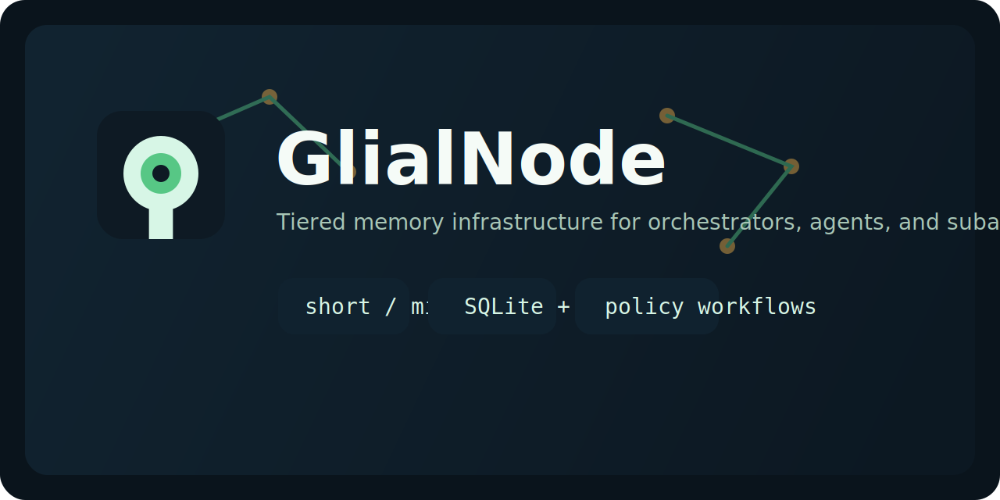
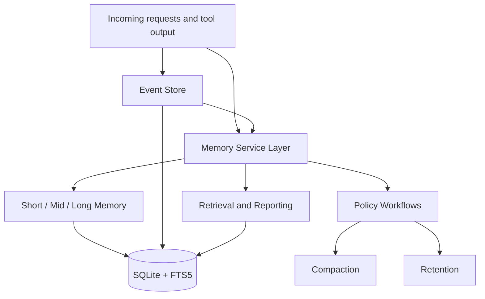

# GlialNode

<p align="center">
  
</p>


GlialNode is a memory system for orchestrators, agents, and subagents.

It is designed for systems that need more than a chat transcript. GlialNode gives you structured memory, scoped recall, lifecycle policy, and operational tooling in one SQLite-first package.

It is built around three ideas:

- tiered memory: short, mid, and long-term state
- scoped memory: separate spaces for different orchestrators, projects, and agents
- retrieval over replay: search and inject only the memory that matters now

## Why GlialNode

Most agent memory attempts fall into one of two traps:

- they replay too much raw history into context
- they store data, but do not manage it as memory

GlialNode takes a different path:

- it separates operational events from curated memory records
- it treats memory as scoped, tiered, and policy-driven
- it supports provenance, lifecycle operations, and observability
- it stays local and inspectable with a SQLite-first architecture

The goal is not just to save facts. The goal is to manage memory as a living system.

## Vision

GlialNode aims to provide a publishable, open-source memory layer for orchestrators, agents, and multi-agent systems.

The v1 architecture is SQLite-first and built around:

- an event log for operational history
- structured memory records with tiers and scopes
- FTS-backed retrieval for continuity and recall
- promotion and decay rules that keep active memory small

## Architecture At A Glance



## Current Capabilities

- create isolated memory spaces
- scope memory to agents, subagents, sessions, tasks, and projects
- store curated records, raw events, and provenance links
- search memory with lexical retrieval and structured filters
- promote, archive, compact, and expire records through explicit policy workflows
- configure compaction and retention policy per space
- apply hardened SQLite defaults for file-backed databases
- inspect memory health through reporting and maintenance commands
- import and export full space snapshots

## How It Fits

GlialNode is a good fit when you want:

- a local-first memory layer
- strong inspectability over opaque hosted storage
- structured recall for multi-agent workflows
- lifecycle operations such as compaction, retention, and maintenance
- a codebase you can extend without needing a separate database service first

It is less ideal if you already need:

- high-concurrency multi-writer coordination
- large-scale semantic/vector retrieval as the primary retrieval mode
- a distributed storage system from day one

## Initial Roadmap

1. Define the v1 domain model for spaces, scopes, events, records, and links.
2. Add the SQLite bootstrap schema and retrieval indexes.
3. Implement a basic repository and memory service layer.
4. Add a small CLI for inspecting spaces, records, and schema state.
5. Publish examples for orchestrator and subagent integration.

## Repo Layout

- `src/core`: shared types and constants
- `src/events`: operational events
- `src/memory`: tier and retrieval logic
- `src/storage`: storage adapters and schema support
- `src/cli`: command-line entrypoints
- `docs`: architecture notes

## Status

GlialNode currently includes:

- the v1 domain model for spaces, scopes, events, records, and links
- a SQLite bootstrap schema with FTS5 indexing and sync triggers
- a working SQLite repository implementation
- a typed `GlialNodeClient` for programmatic use
- retrieval ranking and record promotion helpers
- a functional CLI for spaces, scopes, and memory records
- import/export and memory lifecycle commands
- record provenance and link management
- compaction history with system events and summary records
- per-space policy settings for configurable memory behavior
- SQLite connection hardening with WAL, busy timeout, foreign keys, and runtime inspection
- active retention sweeps with expiration events and summaries
- space-level reporting for memory and lifecycle observability
- unified maintenance workflow for operational upkeep
- repository tests for core persistence and lexical search

## Current Notes

GlialNode currently uses Node's built-in `node:sqlite` module to keep the first release lightweight. In Node 24, that API is still marked experimental, so a later release may choose to wrap it behind a stricter storage boundary or swap the underlying SQLite driver without changing the GlialNode memory model.

File-backed SQLite connections now default to:

- `journal_mode=WAL`
- `synchronous=NORMAL`
- `busy_timeout=5000`
- foreign key enforcement enabled
- defensive mode enabled when the runtime supports it

These defaults make the local single-writer story sturdier, but they do not turn SQLite into a high-concurrency distributed store.

## Quick Start

```bash
npm install
npm run check
npm run test
npm run demo
npm run pack:check
```

The main demo path is Node-based and intended to run on Windows, Linux, and macOS. It builds the project, creates a local demo space, runs maintenance, prints a report, and exports the resulting snapshot.

## Example Report

This is the kind of operational summary GlialNode can emit after maintenance:

```text
spaceId=space_example
records=4
events=2
links=2
tiers=mid:3,short:1
statuses=active:3,expired:1
kinds=summary:2,task:2
recentLifecycleEvents=2
evt_x memory_expired Retention expired mem_y after 0 day(s).
evt_z memory_promoted Compaction promoted mem_a from short to mid.
```

## What The Demo Shows

The demo flow exercises the main operational loop:

1. create a space
2. configure policy
3. add working records
4. run maintenance
5. inspect the resulting report
6. export the final snapshot

That makes it a good first check for whether the current project shape matches your use case.

## Library Example

GlialNode can be used directly from code without shelling out to the CLI:

```ts
import { GlialNodeClient } from "glialnode";

const client = new GlialNodeClient({
  filename: ".glialnode/app.sqlite",
});

const space = await client.createSpace({ name: "Team Memory" });
const scope = await client.addScope({
  spaceId: space.id,
  type: "agent",
  label: "planner",
});

await client.addRecord({
  spaceId: space.id,
  scope: { id: scope.id, type: scope.type },
  tier: "mid",
  kind: "decision",
  content: "Prefer lexical retrieval first.",
  summary: "Retrieval preference",
});

const matches = await client.searchRecords({
  spaceId: space.id,
  text: "lexical retrieval",
  limit: 5,
});

console.log(matches.map((record) => record.summary ?? record.content));
client.close();
```

The client also accepts SQLite connection policy overrides when you need to tune lock handling or journaling for a local deployment.

## Packaging Notes

GlialNode is packaged as both a library and a CLI:

- the library entrypoint is exposed through the package root export
- the CLI entrypoint is exposed through the `glialnode` bin and `./cli` export
- the compiled CLI keeps a Unix shebang so installed package binaries work cleanly across Windows, Linux, and macOS tooling

`npm run pack:check` rebuilds the project, runs `npm pack --dry-run --json`, and validates that the tarball includes the public build artifacts without bundling compiled tests.

## CLI Examples

```bash
glialnode space create --name "Team Memory"
glialnode status
glialnode scope add --space-id <space-id> --type agent --label planner
glialnode memory add --space-id <space-id> --scope-id <scope-id> --scope-type agent --tier mid --kind decision --content "Prefer lexical retrieval first."
glialnode memory search --space-id <space-id> --text lexical
glialnode event add --space-id <space-id> --scope-id <scope-id> --scope-type agent --actor-type agent --actor-id planner-1 --event-type decision_made --summary "Recorded a durable design choice."
glialnode memory promote --record-id <record-id>
glialnode memory archive --record-id <record-id>
glialnode link add --space-id <space-id> --from-record-id <record-a> --to-record-id <record-b> --type derived_from
glialnode memory show --record-id <record-b>
glialnode memory compact --space-id <space-id>
glialnode memory compact --space-id <space-id> --apply
glialnode space configure --id <space-id> --settings "{\"compaction\":{\"shortPromoteImportanceMin\":0.95}}"
glialnode space configure --id <space-id> --retention-short-days 7 --retention-mid-days 30
glialnode space report --id <space-id>
glialnode space maintain --id <space-id>
glialnode space maintain --id <space-id> --apply
glialnode memory retain --space-id <space-id>
glialnode memory retain --space-id <space-id> --apply
glialnode export --space-id <space-id> --output ./exports/team-memory.json
glialnode import --input ./exports/team-memory.json
```

## Comparison

GlialNode is closest to a memory-management layer, not just a context cache.

- use it when you want memory spaces, lifecycle policy, provenance, and inspectable state
- pair it with other context-window tools when you also need aggressive transcript compression
- grow out of SQLite later if concurrency or scale becomes the primary concern

## Current Limitations

- SQLite now uses WAL and a busy timeout by default, but it is still best treated as local single-writer infrastructure
- retrieval is lexical-first; semantic retrieval is not implemented yet
- policy is explicit and rule-based; it is not model-driven
- the extra PowerShell demo script remains Windows-oriented; use `npm run demo` for the portable path

## Publishing Checklist

- `npm run check`
- `npm run test`
- `npm run demo`
- `npm run pack:check`
- review `README.md`, `CHANGELOG.md`, and `docs/architecture.md`
- review `docs/launch-checklist.md`
- follow `docs/publish-guide.md` for the first push

## Project Files

- `assets/glialnode-banner.svg`: repository banner
- `assets/glialnode-mark.svg`: project mark
- `LICENSE`: MIT license
- `CODE_OF_CONDUCT.md`: collaboration expectations
- `CONTRIBUTING.md`: contributor workflow and expectations
- `CHANGELOG.md`: release notes
- `SECURITY.md`: security reporting guidance
- `.github/workflows/ci.yml`: GitHub Actions verification workflow
- `docs/publish-guide.md`: first-publish handoff steps
- `scripts/demo.mjs`: cross-platform end-to-end demo flow for Windows, Linux, and macOS
- `scripts/demo.ps1`: end-to-end local demo flow
